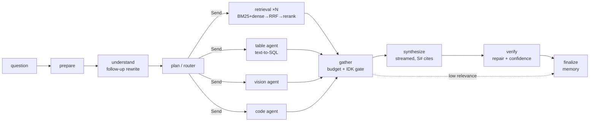

# DocChat — local multi-agent chat over many file types

Upload PDFs, Word, PowerPoint, Markdown/TXT, spreadsheets, images and code, then ask questions
across all of them. Answers are grounded in the sources, cite **file + page / slide / sheet rows /
line numbers**, are **verified claim-by-claim**, carry a **confidence score**, and say
**"I don't know"** when the documents don't support an answer. Everything runs **locally and
offline** with open-source models (Ollama + BGE + Qdrant); no API keys.

## What the brief asked for → how it is done

| Brief requirement | Implementation |
|---|---|
| PDF, DOCX, TXT, MD, PPTX | Layout-aware parsers keep headings, lists, tables, captions, figures, slide notes, page/line positions (`ingest/parsers/`) |
| CSV / XLSX *real* Q&A | Messy-sheet cleaner (title rows, merged two-row headers, totals rows, number-as-text) → Parquet → **text-to-SQL on a locked DuckDB sandbox**, cited to sheet rows (`agents/table.py`) |
| Images: OCR + visual understanding | RapidOCR / Tesseract / PaddleOCR with boxes at ingest; the multimodal LLM describes images at ingest and **re-reads charts with the question** at answer time (`agents/vision.py`) |
| Code files | AST symbol table (methods included), line-numbered evidence, call-site search (`agents/code.py`) |
| Router / Planner agent | Rule-first router over a cheap probe search; LLM planner only for multi-part questions (`agents/router.py`) |
| Retrieval agent (hybrid) | BGE-M3 dense + BM25 sparse in Qdrant, **RRF fusion + cross-encoder rerank**, per-doc diversity (`agents/retrieval.py`) |
| Synthesis agent | Budgeted, document-grouped sources `[S#]`, conflict-aware prompt (`agents/synthesis.py`) |
| Citation / Verification agent | Numeric + citation checks, **automatic citation repair**, batched LLM claim check, unsupported sentences removed (`agents/verification.py`) |
| Layout-aware chunking | Chunks never cross headings; tables/figures/code symbols stay whole; heading breadcrumb prepended for embedding (`ingest/chunking.py`) |
| Citations (file, page) | Clickable citation chips: **PDF page with the quoted sentence highlighted**, image with OCR boxes, SQL + source rows, code lines |
| Cross-document reasoning | Per-document sub-queries for compare/summary questions; sources grouped by document; conflicts surfaced (demo corpus has a planted headcount conflict) |
| Conversation memory | Follow-up rewriting, previous answer's documents and SQL reused, rolling summary; LangGraph SQLite checkpoints per chat |
| Large / many files | Content-hash dedup, background ingestion with progress, page-streamed parsing, batched embeddings, Qdrant server mode |
| Graceful "I don't know" | Four gates: no docs · low reranker relevance (LLM skipped) · model says NOT_FOUND · nothing verifiable. Lists the closest sources checked |
| Confidence / self-verification | `0.45·verified + 0.20·source relevance + 0.20·citation coverage + 0.15·numbers verified` with caps; calibration (ECE) measured by the evaluator |
| Fully local | Ollama for LLM + embeddings, ONNX reranker/OCR, embedded Qdrant; `docchat prefetch` then `HF_HUB_OFFLINE=1` |

## Architecture



Stack: **LangGraph** (fan-out with `Send`, deferred fan-in, SQLite checkpointer) · **Ollama**
(`qwen3.5:4b` default, `gemma4` switchable; one multimodal model serves chat and vision) ·
**BGE-M3** embeddings · **Qdrant** (embedded or server) · **FastEmbed** `bge-reranker-base`
(or `bge-reranker-v2-m3` on GPU) · **PyMuPDF** (default), **Docling**, **Marker**, **Unstructured**
parsers · **RapidOCR**, **Tesseract**, **PaddleOCR** · **DuckDB + sqlglot** · **Streamlit**.

## Quick start (Windows)

Prerequisites: [uv](https://docs.astral.sh/uv/), [Ollama](https://ollama.com) ≥ 0.34.4, and the
Microsoft Visual C++ runtime (`winget install Microsoft.VCRedist.2015+.x64`, usually present).

```bash
ollama pull qwen3.5:4b          # or: ollama pull gemma4:e4b
ollama pull bge-m3
uv sync                          # core install (CPU); no PyTorch
uv run docchat prefetch          # once, online: reranker + OCR models -> ./models
uv run python scripts/make_demo_corpus.py --large-pages 300   # demo files + golden Q&A
uv run docchat doctor            # checks everything, prints fixes
uv run docchat                   # opens the app -> "Load demo corpus" -> ask
```

### GPU demo machine (NVIDIA)

```bash
uv sync --extra docling --extra rerank-gpu --extra code --extra cuda
```

Then in `.env` (copy from `.env.example`): `DOCCHAT_LLM_MODEL=qwen3.5:9b` or `gemma4:12b`,
`DOCCHAT_RERANKER_BACKEND=sentence-transformers`, `DOCCHAT_RERANKER_MODEL=BAAI/bge-reranker-v2-m3`,
`DOCCHAT_PDF_PARSER=docling`, `DOCCHAT_NUM_CTX=32768`. Ollama server settings (Windows user
environment variables, then restart Ollama from the tray): `OLLAMA_FLASH_ATTENTION=1`,
`OLLAMA_KV_CACHE_TYPE=q8_0`, `OLLAMA_NUM_PARALLEL=2`, `OLLAMA_KEEP_ALIVE=30m`.
The `cuda` extra installs PyTorch cu128 wheels (driver ≥ 570); `cpu` and `cuda` are mutually exclusive.

Marker is installed separately because it pins old dependencies: `uv tool install marker-pdf`.

## Configuration

All settings are environment variables with the `DOCCHAT_` prefix (or `.env`); see
`src/docchat/config.py` and `.env.example`. The sidebar overrides model, answer mode, PDF parser
and OCR engine per session. Answer modes: **Fast** (rule-based verification), **Balanced**
(+ LLM claim check), **Deep** (+ thinking mode for the answer and one LLM revision pass for
claims that fail verification).

## CLI

```bash
uv run docchat ingest demo_corpus/            # index files / folders
uv run docchat ask "Which regions missed their FY2025 target?" "And by how much?"
uv run docchat ask --mode deep --json "How many employees does Acme have?"
uv run docchat eval                           # golden-set evaluation -> data/eval/report_*.json
uv run docchat eval --judge gemma4:12b        # + LLM-as-judge with a different model
uv run docchat graph                          # agent graph as Mermaid
```

The embedded Qdrant store allows one process at a time: stop the UI before using the CLI, or run
`docker compose up -d qdrant` and set `DOCCHAT_QDRANT_URL=http://localhost:6333`.

## Evaluation

`docchat eval` scores the golden set generated with the demo corpus (34 questions, plus a
needle-in-a-300-page-PDF question with `--large`):

* **Retrieval ablation** — hit@5 / MRR for dense-only, BM25-only, hybrid (RRF), hybrid + rerank
* **Answers** — accuracy by type (lookup, table, OCR, vision, code, cross-doc, follow-up), exact
  numeric match on spreadsheet questions, citation precision/recall (file and page)
* **Trust** — abstention precision/recall on unanswerable questions, confidence calibration (ECE)
* **Speed** — p50 / p95 latency, LLM calls per answer

The latest report is shown in the app under **How it works**.

## Development

```bash
uv run pytest                      # unit + graph + UI tests (no Ollama needed)
uv run pytest tests/unit/test_graph.py -k followup   # a single test
uv run pytest -m ollama tests/integration/test_real_llm.py -v -s   # component tests on the real LLM
uv run pytest -m ollama tests/integration/test_ollama_stack.py -v  # whole system on the real models
```

Real-model tests are marked `ollama`, so the default run excludes them, and they skip when
Ollama or a model is missing. `test_real_llm.py` covers the model contract (JSON reliability,
streaming, thinking, vision, `num_ctx`, concurrency), the embeddings, and each LLM-driven agent in
isolation, such as text-to-SQL on the golden spreadsheet questions or the verifier catching a
contradiction.

Options:
- `DOCCHAT_TEST_MODELS="qwen3.5:4b,gemma4:e4b"` compares several models.
- `DOCCHAT_TEST_GOLDEN=1` also runs the whole golden set with accuracy thresholds.

## Troubleshooting

* **`DLL load failed` for pymupdf / onnxruntime** — install the Visual C++ runtime (above).
* **"store is in use by another process"** — embedded Qdrant is single-process; see CLI note.
* **TLS `UnknownIssuer` during `uv sync`** behind a corporate proxy — add `--system-certs`.
* **Slow on CPU** — use *Fast* mode and a small model; answers stream while agents run.

## Licences

All components are open source. Note PyMuPDF is AGPL-3.0 (fine for a local demo; use Docling,
MIT, for permissive setups) and Marker's model weights use a modified OpenRAIL-M licence.
